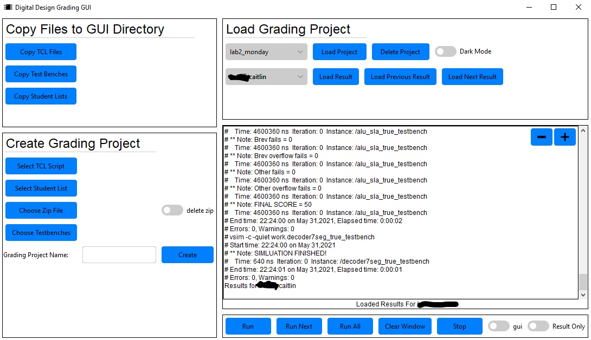
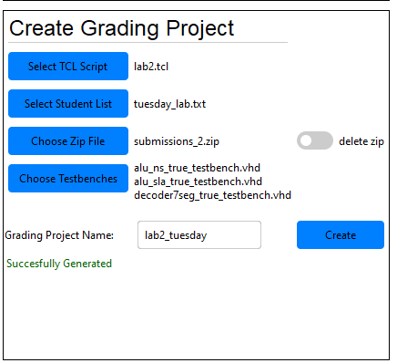
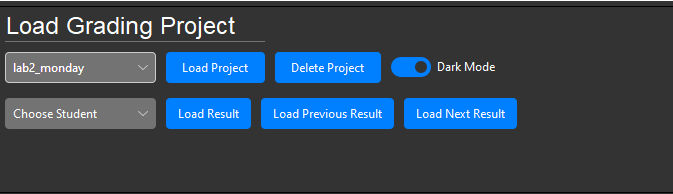
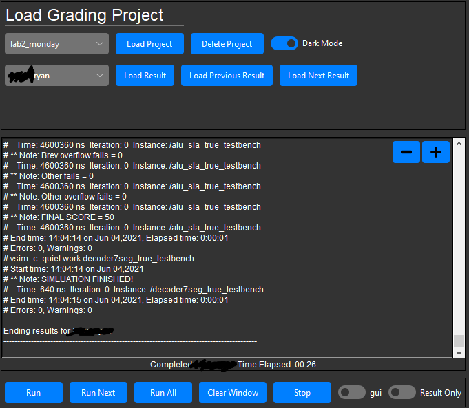
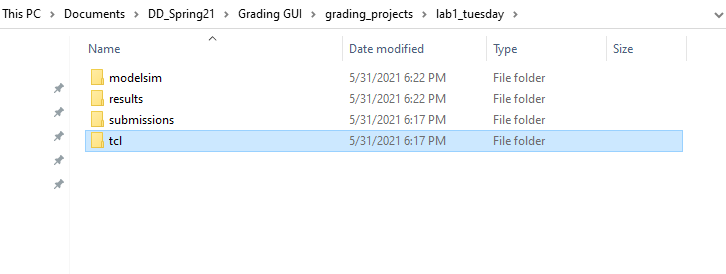

# Digital Design Grading GUI 

## Purpose
The purpose of this project is to make grading much easier for Digital Design TAs. This project combines the python 
auto grading scripts written by Keeth Smith with a simple UI that lets TAs create grading projects, run testbenches on 
their student submissions, and easily retrieve previous grading results. 
## How to Install
* From Github Repo - Clone the Github repository and run the main.py file
* From Installer - Download the installer from the Dropbox link below. Run the installer (You may need to disable your 
  antivirus software to install this. Avast gave me all sorts of trouble with this, including installing properly but 
  not letting the program run properly afterwards). After you install, I recommend making a shortcut on your desktop.
* Installer Download - https://www.dropbox.com/s/6hrnajr132ixxn6/Grading_gui_installer.exe?dl=0
* **Dependencies - Modelsim Starter Edition 20.1 or newer** - https://fpgasoftware.intel.com/20.1/?edition=lite&platform=windows&product=modelsim_ae#tabs-2
## How to Use
* Overall GUI format

  

* Copy Files to GUI Directory - This part of the grader is completely optional. This section will just make a copy of 
the student list, testbenches, and tcl scripts to the program's default directory which makes creating a grading project 
a little bit easier. 

* Create Grading Project - Here you choose the specified tcl script that will be applied to each student, the submissions 
zip file from canvas, your list of students that you want to grade from that zip file, whether you want to delete the 
zip file after you extract it or not, your chosen testbenches, and the name for the grading project. If you click the
create button and nothing seems to happen for 30 seconds or more, you may have antivirus issues with the program.
  

  

* Loading a grading project - After you create a grading project, you can select it from load grading 
project drop down list and then either load the project, which will populate the student list, or delete the project
which will remove the project from the drop down list and delete the corresponding directory. After you load a project,
the student list dropdown will populate with student names. You will use this dropdown menu to load previous saved 
grading results and for running the grading scripts. You can also toggle the color theme of the app from this menu.

  

* running a grading project - There are a few different ways to run the grading scripts. You can click the "run all" 
button which will run the remainder of the students starting from the current student (or the first student if no student 
is selected). You can also select a student from the dropdown list and click the "run" button to just run their files or
click run next to select the next student and run their files. The grader automatically saves the last result for each 
student that is run as a text file inside the grading project directory. You can view these saved results in the program 
window by selecting a student from the dropdown and selecting "load result". "Load Previous Result" and "Load Next Result"
will load the results of the previous and next student respectively. The "clear window" button clears the output window,
the "stop" button will stop any currently running files, the "gui" selector will launch the modelsim gui instead of 
displaying the results in this grading program when enabled, and the "results only" selector will remove the compilation
information from the output and only display the result from the testbench itself. 

  

## Grading Project File Structure
Inside the program directory, you can find the grading_projects directory which holds all the generated grading 
projects and all the saved grading information. 
* The modelsim directory will hold the modelsim .mpf file 
* The results directory holds all the text files with saved results
* The submissions folder holds the files from each student in the student list that was extracted from the submissions zip
* The tcl directory contains the generated .tcl file for each student (this is what is run for each individual student when grading).

  

## How to Create New Files for This Program
* TCL Files - Copying the format of the given TCL files should work for any future labs. The only thing to note is that
**testbenches must end in "_true_testbench.vhd" or they will be removed from the project after one student is run**.
* Testbenches - Although it is not required, this tool works best with testbenches that implement some kind of auto 
grading scheme. A good example of this is the lab 5 CGD testbench that automatically gives a score for each GCD
architecture.
* Student Lists - Follow the example in the studentlists directory. The format is "First Name [Middle Name(optional)] Last Name"

## Technology and Programming Languages Used
* Python, Tkinter, Tcl

## Contributors
* Jovanny Vera - https://github.com/Jovanny02
* Keeth Smith - https://github.com/KeethSmith

## Credits
* plus Icon made by srip from www.flaticon.com
* subtract Icon made by Dave Gandy from www.flaticon.com
* integrated circuit Icon made by freepik from www.flaticon.com
* light and dark themes made by rdbende from https://github.com/rdbende/Azure-ttk-theme